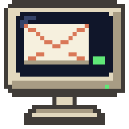

# MAIL



An e-mail program for the Atari ST, STE, TT and Falcon, written in C for
GEM. It reads mail over IMAP or POP3, sends it over SMTP, keeps a mirror
of your IMAP folders on disk so you can read offline, and reads and
writes Hebrew.

- IMAP with a local mirror: headers of the newest messages and every
  message you've read, kept in step with the server; big folders load
  100 messages at a time, with "Load more" for older ones
- POP3 that downloads into local folders and never fetches a message twice
- SMTP with login (AUTH PLAIN/LOGIN), an Outbox for sending later, copies
  in Sent
- Reply, reply to all, forward (with the original's attachments), flags,
  move, delete to Trash, folders, address book, signatures
- Attachments: save them with the file selector; attach files when writing
- HTML-only mail shown as text
- Hebrew: UTF-8, ISO-8859-8 and windows-1255 mail, Hebrew subjects, names,
  file names and folder names, right-to-left layout, and the Israeli
  keyboard on F10
- One main window with draggable panes (folders, list, message), right-click
  menus, a choice of fonts (GDOS fonts too), passwords hidden behind an eye
  button; window and pane sizes are kept between sessions
- Runs on TOS 1.04 to 4.x, EmuTOS, MagiC and MiNT, with STinG or
  MiNTnet; from a 68000 ST in medium resolution to a Falcon in 640×480

```
Atari (MAIL.PRG) --STinG/MiNTnet--> Raspberry Pi (stunnel) --TLS--> your mail provider
```

Mail providers want encrypted connections, which are too heavy for a
68000 or 68030, so a Raspberry Pi on your network does the encryption:
see [gateway/README.md](gateway/README.md). A server that accepts plain
connections can be used directly.

MAIL follows the design of Troll, the GFA-BASIC newsreader and mail
client by Rajah Lone: the same four windows (folders, message list,
message, editor), IMAP mirroring, and STinG or MiNTnet networking. It
reuses parts of Claude ST
([whomper/atari_claude](https://github.com/whomper/atari_claude)): the
freestanding TOS runtime, GEM bindings, STinG client, Hebrew
right-to-left layout and keyboard, and the Hatari test tools.

## Getting started

1. Copy `MAIL.PRG` into a folder of its own on your Atari, e.g. `C:\MAIL\`.
2. Set up the gateway on a Raspberry Pi: `sudo gateway/install.sh
   imap.gmail.com smtp.gmail.com` (see [gateway/README.md](gateway/README.md)).
3. Start MAIL and fill in your account: the Pi's IP address, ports 1143
   (IMAP) and 1025 (SMTP), your login.

The [user guide](docs/GUIDE.md) describes everything else.

## Building

```
sudo apt install gcc-m68k-linux-gnu      # Debian/Ubuntu
make                                     # writes MAIL.PRG
```

No MiNTLib is needed: the program is freestanding (`atari/`) and
`tools/elf2tos.py` writes the TOS executable. It is built for the 68000,
so it runs on every Atari from the ST to the Falcon.

## Source

```
atari/   TOS runtime: start-up, system calls, a small C library, AES/VDI,
         TCP over STinG/STiK or MiNTnet (with a DNS client)
src/     the mail core: IMAP, POP3, SMTP, MIME, charsets and Hebrew,
         bidi, the local store, composing, mail operations
ui/      the GEM program: windows, drawing, editor, dialogs, menus
gateway/ the Raspberry Pi gateway (stunnel)
tests/   unit and integration tests, the Hatari test rig
tools/   elf2tos.py, the icon generator, FAKESTNG.PRG (for testing in Hatari only)
icons/   MAIL's desktop icon (RSC and ICN files)
```

## Tests

The mail core (`src/`) also builds on Linux, where it is tested against
real servers before it runs on the Atari:

```
make test           # charsets (Hebrew), MIME, message building, bidi
make itest          # IMAP, POP3, SMTP against a local Dovecot and a test SMTP server
TLS=1 make itest    # the same through the gateway's stunnel set-up, TLS-only servers
```

`make itest` needs `dovecot-imapd` and `dovecot-pop3d`; `TLS=1` also
needs `stunnel4`.

`tests/hatari/` runs MAIL.PRG itself in the
[Hatari](https://hatari.tuxfamily.org/) emulator with
[EmuTOS](https://emutos.sourceforge.io/), with Xvfb and xdotool:

```
make -C tools/fakesting
tests/hatari/net_test.py /tmp/mail-net etos512us.img   # Falcon, real servers
tests/hatari/ui_tour.py WORKDIR etos512us.img          # screenshots of the interface
```

`net_test.py` boots an emulated Falcon, where MAIL logs in to Dovecot,
mirrors the inbox, opens a Hebrew message and sends a Hebrew reply; the
test checks the reply and its copy in Sent on the server. Hatari has no
network card, so `FAKESTNG.PRG` stands in for STinG and carries MAIL's
connections over the emulated serial port to `serial_bridge.py`. It's
for the emulator only; never install it on a real Atari.
